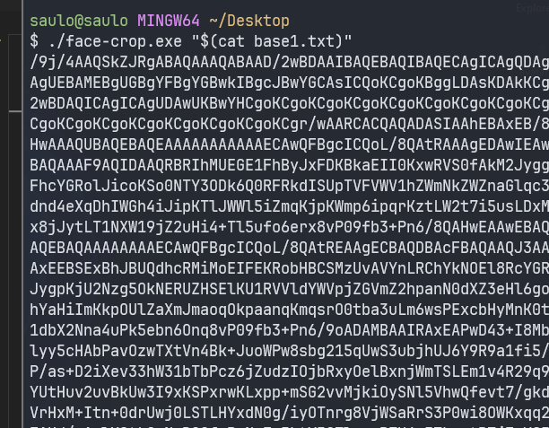

# Detector de Rosto com Recorte em 16:9

Este projeto detecta o rosto de uma pessoa em uma imagem fornecida em **Base64**, faz um recorte expandido para capturar toda a cabeça e ombros e mantém a proporção **16:9**. O resultado é salvo como uma imagem `.jpg`.



## Funcionalidades

- **Detecção de rosto**: Detecta automaticamente o rosto principal na imagem.
- **Recorte expandido**: Captura a cabeça inteira e parte dos ombros.
- **Proporção 16:9**: Garante que a imagem final siga essa proporção.
- **Conversão Base64**: Converte imagens de e para Base64, permitindo fácil manipulação e transferência.

---

## Tecnologias Utilizadas

- **Python 3**
- **OpenCV**: Para detecção de rosto e manipulação de imagem.
- **NumPy**: Para manipulação de arrays.
- **Base64**: Para codificação e decodificação de imagens.

---

## Como Usar

### Pré-requisitos

1. **Python 3** instalado.
2. Instale as dependências:
   ```bash
   pip install opencv-python-headless numpy
   ```

````

### Passo a Passo

1. Clone este repositório:

   ```bash
   git clone https://github.com/saulotarsobc/face-crop.git
   cd seu-repositorio
   ```

2. Coloque a **imagem em Base64** no arquivo `exemplo_base64.txt`.

3. Execute o script:

   ```bash
   python seu_script.py
   ```

4. O recorte da imagem será salvo como `rosto.jpg` e a saída em Base64 será salva em `rosto_base64.txt`.

---

## Estrutura do Projeto

```
📁 seu-repositorio/
│
├── exemplo_base64.txt          # Arquivo com a imagem em Base64 de entrada
├── rosto.jpg                   # Saída: imagem recortada em 16:9
├── rosto_base64.txt            # (Opcional) Saída em Base64 do recorte
├── seu_script.py               # Código principal
└── README.md                   # Documentação do projeto
```

---

## Exemplo de Uso

### Imagem Base64 de Entrada

```text
/9j/4AAQSkZJRgABAQEAAAAAAAD/2wCEABALD...
```

### Saída (Recorte Expandido em 16:9)


---

## Possíveis Erros

- **Nenhum rosto detectado**: Certifique-se de que a imagem fornecida contém um rosto claramente visível.
- **Arquivo inválido**: Verifique se o Base64 fornecido está correto e corresponde a uma imagem.

---

## Contribuição

Sinta-se à vontade para abrir **issues** e enviar **pull requests** para melhorias ou correções.

---

## Licença

Este projeto é licenciado sob a [MIT License](https://opensource.org/licenses/MIT).

---

## Autor

Desenvolvido por **Saulo Costa**. 👨‍💻
````
